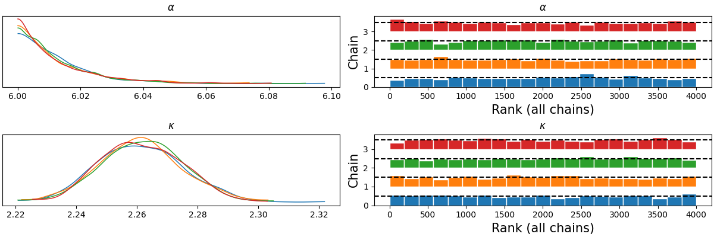

---
# try also 'default' to start simple
theme: default
layout: intro
# apply any windi css classes to the current slide
class: 'text-center'
# some information about the slides, markdown enabled
info: PhD presentation
# persist drawings in exports and build
drawings:
  persist: false
# use UnoCSS (experimental)
css: unocss
wakeLock: "build"
---

# Untying the Gordian Knot of Bayesian Inference in Markov Networks

Signal Processing Laboratory • Department of Electrical and Computer Engineering • São Carlos School of Engineering • University of São Paulo

  

    Luiz Desuó Neto 
    Prof. Carlos Dias Maciel 
    2025
  

---

# Content

- Introduction
- Objectives and contributions
- Markov random fields
- Nonparanormal (NPN) models
- Neighborhood system prior driven by SPDEs
- Bernstein marginals
- Bayesian nonparanormal network architecture
- Experimental analysis
- Precipitation data
- Results
- Discussion and conclusions
- Future works

---

# Introduction

- **Structured probabilistic models (SPMs)**
  - Integrate probability theory and network theory to model complex multivariate distributions
  - Enable explainable (XAI), auditable, robust AI via explicit stochastic structure
- **Core families**
  - **Bayesian networks (BNs)**: directed acyclic graphs -- generative semantics
  - **Markov random fields (MRFs)**: undirected graphs -- symmetric dependencies (spatial data)
- **Dependency modeling with copulas**
  - Decouple marginals and dependence (Sklar’s theorem)
  - Vine/cherry-tree decompositions into tractable low-order building blocks
- **Inference challenge -- MRFs**
  - Doubly intractable posterior and noninterpretable potentials: $p(\boldsymbol{\theta} \mid \mathbf{x}) = \frac{1}{\underbrace{Z(\mathbf{X}) Z(\boldsymbol{\theta})}_{\text{double intractability}}} p(\boldsymbol{\theta}) q(\mathbf{x}, \boldsymbol{\theta})$
- **Thesis goal**: circumvent partition-function bottleneck while preserving probabilistic coherence for MRF methods (interpretability)

---

# Objectives and contributions

- Copula‐based ($R_{c_i}$ -- copula ratio [^1]) **Besag's pseudolikelihood** approximation [^2]
  $$p(\mathbf{x}) \approx \prod_{i=1}^{d} R_{c_i}\left(F_i(x_i), F_{i1}(y_{i1}), \ldots, F_{ik_i}(y_{ik_i})\right) \, p(x_i), \quad \mathcal{N}_{\mathscr{G}}(X_i) = \left\{Y_{i1}, \ldots, Y_{ik_i}\right\}$$
- Theoretical perspective for **copula decomposable Markov random fields**
  $$
  \begin{gather*}
  p(\mathbf{x}) = \left[\prod_{i=1}^{|\mathscr{C}|}\widetilde{R}_{c_i} \left(u_{i1},\ldots,u_{ik_i},v_{i1},\ldots,v_{il_i}\right)\right] \left[\prod_{j=1}^{d} p(x_j)\right]\\
  U_{ij} = F_{Y_{ij}}(Y_{ij}) \colon j \in \{1,\ldots,k_i\} \colon Y_{ij} \in \mathcal{S}_i \quad\text{and}\quad V_{im} = F_{Z_{im}}(Z_{im}) \colon  m \in \{1,\ldots,l_i\} \colon Z_{im} \in \mathcal{R}_i
  \end{gather*}
  $$
- **Nonparanormal network architecture** and extreme precipitation application ($\approx$ non-Gaussian processes)

[^1]: [(Elidan, 2010)](https://proceedings.neurips.cc/paper/2010/hash/2a79ea27c279e471f4d180b08d62b00a-Abstract.html)
[^2]: [(Desuó, 2025)](https://doi.org/10.1016/j.eswa.2025.127137)

---

## Markov random fields

  - Undirected graph $\mathscr{G} = \{\mathscr{V}, \mathscr{E}\}$
    - $\mathscr{V}$: random variables
    - $\mathscr{E} \subseteq \mathscr{V \times V}$: conditional dependencies
  - Neighborhood: $X \sim_{\mathscr{G}} Y \iff Y \in \mathcal{N}_{\mathscr{G}}(X)$
    - reflexive and symmetric
  - Cliques: complete induced subgraph
    - Maximal: not extendable
    - Factorization (Gibbs fields):
    $$p\left(\mathbf{x} \mid \boldsymbol{\theta}\right) = \frac{\prod_{\mathcal{C} \in \mathscr{C}} \psi_{\mathcal{C}}\left(\mathbf{x}_\mathcal{C} \mid \boldsymbol{\theta}_\mathcal{C}\right)}{\int_{\mathscr{X}} \prod_{\mathcal{C} \in \mathscr{C}} \psi_{\mathcal{C}}\left(\mathbf{x}_\mathcal{C} \mid \boldsymbol{\theta}_\mathcal{C}\right) \mathrm{d} \mathbf{x}}$$
  - Hammersley–Clifford theorem: every Gibbs system is Markovian

<v-switch>

<template #0>

## Pairwise Markov property

$$
\begin{equation*}
\text{Any} \, X_i \not\sim_{\mathscr{G}} X_j \colon X_i \!\perp\!\!\!\perp X_j \mid \mathbf{X}_{-ij}
\end{equation*}
$$

$$
\begin{equation*}
\color{red}{X_1} \, \color{black}{\!\perp\!\!\!\perp} \, \color{green}{X_6} \, \color{black}{\mid} \, \color{blue}{\{X_2, X_3, X_4, X_5, X_7\}}
\end{equation*}
$$

</template>

<template #1>

## Local Markov property

$$
\begin{equation*}
X \!\perp\!\!\!\perp \mathscr{V} \setminus \mathcal{N}_{\mathscr{G}}[X] \mid \mathcal{N}_{\mathscr{G}}(X)
\end{equation*}
$$

$$
\begin{equation*}
\color{red}{X_2} \, \color{black}{\!\perp\!\!\!\perp} \, \color{green}{\{X_4, X_5, X_6\}} \, \color{black}{\mid} \, \color{blue}{\{X_1, X_3, X_7\}}
\end{equation*}
$$

</template>

<template #2>

## Global Markov property

$$
\begin{equation*}
\mathbf{X}_A \!\perp\!\!\!\perp \mathbf{X}_B \mid \mathbf{X}_S
\end{equation*}
$$

$$
\begin{equation*}
\color{red}{\{X_2, X_7\}} \, \color{black}{\!\perp\!\!\!\perp} \, \color{green}{\{X_4, X_6\}} \, \color{black}{\mid} \, \color{blue}{\{X_1, X_3\}}
\end{equation*}
$$

</template>

</v-switch>

---

# Nonparanormal (NPN) models [^1]

Special case of the **transelliptical family** [^2] $(\mathbf{X} \stackrel{d}{=} \boldsymbol{\mu} + \xi \mathbf{L}_{\mathbf{\Sigma}} \mathbf{U})$ with probability density function

$$p(\mathbf{x}) = (2\pi)^{-d/2} |\mathbf{\Omega}|^{-1/2} \, \exp \left(-\frac{1}{2} \mathbf{\Psi}(\mathbf{x})^\mathrm{T} \, \mathbf{\Omega}^{-1} \, \mathbf{\Psi}(\mathbf{x}) \right) \prod_{i=1}^d \left|\frac{\mathrm{d} \Psi_i(x_i)}{\mathrm{d} x_i}\right|,$$

and cumulative distribution function

$$F(\mathbf{x}) = \Phi_{\mathbf{\Omega}} \left(\Psi_1(x_1), \ldots, \Psi_d(x_d)\right),$$

in which $\{\Psi_i(\cdot)\}$ are continuously differentiable bijections.

NPN models generalize the **Gaussian copula** $(\Psi_i = \Phi^{-1} \circ F_i)$, and they admit an **MRF representation** on a structure $\mathscr{G}$: $\mathbf{\Omega}_{ij}^{-1} \neq 0$ if and only if $X_i \sim_{\mathscr{G}} X_j$, for all $i, j \in \set{1, \ldots, d} \colon i \neq j$.

[^1]: [(Liu, 2009)](https://www.jmlr.org/papers/v10/liu09a.html)
[^2]: [(Liu, 2012)](https://proceedings.neurips.cc/paper/2012/hash/af8d1eb220186400c494db7091e402b0-Abstract.html)

---

# Neighborhood system prior driven by SPDEs

Let $\mathbf{W}(\mathbf{s})$ denotes Gaussian white noise, and $\mathbf{X}(\mathbf{s})$ a random field described by the SPDE

$$
\begin{equation*}
\tau \, \left(\kappa^2 - \Delta_{\mathbf{s}}\right)^{\alpha/2} \mathbf{X}(\mathbf{s}) = \mathbf{W}(\mathbf{s}) , \quad \mathbf{s} \in \Omega,
\end{equation*}
$$

$\mathbf{L}$ is the **discrete Laplacian** on $\Omega_h$ $(\Delta_{\mathbf{s}}(\cdot) = \sum_{i=1}^d \frac{\partial^2}{\partial s_i^2}(\cdot) \approx - \mathbf{L})$ with spectral decomposition $\mathbf{L} = \mathbf{Q} \mathbf{\Lambda} \mathbf{Q}^\mathrm{T}$.

The **Gaussian Markov random field** defined on $\Omega_h$ has **covariance matrix** [^1]

$$
\begin{equation*}
\mathbf{\Sigma} = \mathbf{Q} \, \left\{\tau^{-2} \left(\kappa^2 \mathbf{I} + \mathbf{\Lambda}\right)^{-\alpha}\right\} \, \mathbf{Q}^\mathrm{T} .
\end{equation*}
$$

The **correlation matrix** is

$$
\begin{equation*}
\mathbf{\Omega} = \mathbf{S}^{-1} \mathbf{Q} \, \left(\kappa^2 \mathbf{I} + \mathbf{\Lambda}\right)^{-\alpha} \, \mathbf{Q}^\mathrm{T} \mathbf{S}^{-1}
\end{equation*}
$$

with $\mathbf{S}_{ii} = \sqrt{\sum_{r=1}^d \mathbf{Q}_{ir}^2 \left( \kappa^2 + \lambda_r \right)^{-\alpha}}, \quad \mathbf{S}_{ij} = 0 \quad \forall i, j \in \set{1, \ldots, d} \colon i \neq j .$

[^1]: [(Lindgren, 2011)](https://doi.org/10.1111/j.1467-9868.2011.00777.x)

---

# Bernstein marginals

### Probability density function [^1] [^2]

$$
\begin{equation*}
p_k(x) = \sum_{j=1}^{k} w_j \beta_{j,k}(x), \; \mathbf{w} \in \Delta^k, x\in[0,1]
\end{equation*}
$$

### Cumulative distribution function

$$
\begin{equation*}
F_k(x) = \sum_{j=1}^{k} w_j \left[\int_0^x \beta_{j,k}(z) \, \mathrm{d} z\right]
= \sum_{j=1}^{k} w_j\, \mathcal{B}_{j,k}(x)
\end{equation*}
$$

[^1]: ([Petrone, 1999](https://doi.org/10.2307/3315494); [Petrone, 1999](https://doi.org/10.1111/1467-9469.00155))

[^2]: $\beta_{j,k}(x) \propto x^{j-1}(1-x)^{k-j}$

---

# Bayesian nonparanormal network architecture

  

  

  

  

  - Data transformation [^1]

  $$Y = \frac{X - A(X)}{B(X) - A(X)}$$

  - Bernstein basis

  $$\Psi(y) = \Phi^{-1}\left(\sum_{j=1}^{k} w_j\, \mathcal{B}_{j,k}(y)\right)$$

  - SPDE kernel

  $$\mathbf{\Omega} = \mathbf{S}^{-1} \mathbf{Q} \, \left(\kappa^2 \mathbf{I} + \mathbf{\Lambda}\right)^{-\alpha} \, \mathbf{Q}^\mathrm{T} \mathbf{S}^{-1}$$

  

[^1]: [(Turnbull, 2014)](https://doi.org/10.1016/j.csda.2013.10.021)

---

  

  ## Bernstein marginals analysis

  - Prior predictive check
  - Benchmark: 28 densities [^1]
  - Sample size: $n \in \{50, 500\}$
  - Number of basis functions: $k \in \{10, 40\}$
  - Prior sensitivity: a symmetric concentration parameter, $\zeta' \in \{1.0, 2.0\}$, such that $\mathbf{w} \sim \textsf{Dirichlet}(\bm{\zeta})$ with $\zeta_j = \zeta'$ for all $j$.

  ## Computational setting

  - Intel Core i7 processor (8-core, 2.90 GHz)
  - 16 GB RAM
  - GeoPandas • OSMnx • NetworkX • PyDAP • Banquo • NumPyro • JAX • ArviZ (PSIS-LOO-CV)

  

  

  ## Prediction of extreme precipitation (Porto Alegre/RS)

  

  **Models:** NPN network • Conditional autoregressive (CAR) model • Besag–York–Mollié (BYM$_2$) model • NPN distribution • Bernstein-Dirichlet (BD) marginals

  

[^1]: [(Berlinet, 1994)](https://hal.science/hal-03659919)
---

# Precipitation data

  

  

  - January 1, 1998 -- June 30, 2024 (9677 days)
  - Block maxima: 318 monthly observations
  - GPM_3IMERGDF_07 -- 0.1° $\times$ 0.1° -- Daily [^1]

  

  

  

  $$\tau_{XY} = \frac{2}{n(n-1)} \sum_{i<j} \operatorname{sgn}(X_i-X_j)\operatorname{sgn}(Y_i-Y_j)$$

  

[^1]: [GPM_3IMERGDF_07 info](https://gpm1.gesdisc.eosdis.nasa.gov/dods/GPM_3IMERGDF_07.info)

---

# Bernstein-Dirichlet: prior predictive simulations

  

  

  

  

  

  

  

  

  

  - Flat Dirichlet $(\zeta' = 1.0)$: less informative, don't favor a particular weight configuration
  - $\zeta' = 2.0$: induces greater variability among the weights
  - $k = 10$: densities are smoother and less oscillatory
  - $k = 40$:
    - higher-order polynomial approximation
    - undulating behavior
    - captures more complex features

  

---

# Bernstein-Dirichlet: benchmark

  

  ### The good

  

  

  

  

  

  

  

  

  ### The bad

  

  

  

  

  

  

  

  

  ### The ugly

  

  

  

  

  

  

  

---

# Spatial prediction of extreme precipitation: marginals

  

  

  

  

  

  

  

  

  

  

  

  

  

  

  

  

  

  

  

  

  

  

  

  

  

  

  

  

  

  

  

  

  

  

  

  

  

  

  

  

  

  

  

  

---

# Spatial prediction of extreme precipitation: comparison

  

  |       Model      | $\widehat{\text{elpd}}_{\text{loo}}$ | $\widehat{p}_{\text{loo}}$ |   SE   | Time[s] |
  |:----------------:|:------------------------------------:|:--------------------------:|:------:|:-------:|
  | NPN network      |               -14917.23              |            55.73           | 212.24 | 1157.73 |
  | CAR              |               -13519.57              |           188.74           |  33.01 |  28.99  |
  | BYM$_2$          |               -10846.87              |           159.89           | 384.59 | 1232.94 |
  | NPN distribution |               -10348.27              |           162.29           | 192.72 | 3025.63 |
  | BD marginals     |               -3733.70               |            32.61           |  84.24 |  33.56  |

  

  

  - Deviance scale (-2 log-score)
  - NPN network: best $\widehat{\text{elpd}}_{\text{loo}}$ and $\downarrow \widehat{p}_{\text{loo}}$
  - CAR: competitive ($\uparrow \widehat{\text{elpd}}_{\text{loo}}$ and $\downarrow$ runtime)
  - BYM$_2$: separates structured/unstructured noise
  - NPN distribution: no neighborhood structure
  - BD marginals: independent marginals

  

  

---

# Discussion and conclusions

- **Semiparametric marginal estimation (Bernstein–Dirichlet)**
  - **Advantages:** smooth joint PDF/CDF estimation • monotonic CDF by construction
  - **Limitations:** *sensitive* to prior choice • heavy tails • disjoint supports • narrow multimodal densities
- **Bayesian nonparanormal network architecture**
  - **Advantages:** outperformed baselines in expected LOO-CV predictive accuracy • semiparametric marginal modeling • spectral governance of spatial dependence resolves limitations of static adjacency-based models
  - **Limitations:** Cholesky $\mathcal{O}(d^2) \text{--} \mathcal{O}(d^{3/2})$ • no tail dependence • Bernstein–Dirichlet limitations
- **Innovations and broader implications**
  - **Copula‐based Besag's pseudolikelihood:** partition-free MRF inference
  - **Copula decomposable Markov random fields:** tractable high-dimensional dependencies
  - **NPN network architecture:** unify Bernstein marginals with SPDE precision operators
  - Generalizability -- network-based abstraction • infrastructure resilience and climate adaptation

---

# Future works

- Scalable non-separable spatio-temporal dependency modeling (stochastic heat equation)
  $$\left[\frac{\partial}{\partial t} + \gamma \left(\kappa^2 - \Delta\right)^{\alpha/2}\right] \tau \mathbf{X}(\bm{\xi}) = \mathbf{W}(\bm{\xi})$$
- Dynamic Bernstein-Dirichlet univariate models
- Conditional Bernstein-Dirichlet models
- Integration with machine learning architectures (Bayesian deep learning)
- Other copula families
- Scalable inference for large‑scale networks

---
layout: center
class: text-center
---

# Thank you!
